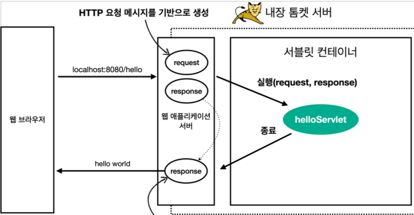
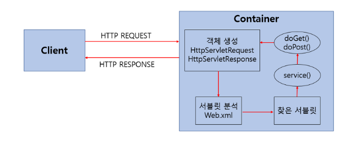

# Spring MVC

## Servlet
클라이언트의 요청을 처리하고, 그 결과를 반환하는
Servlet 클래스의 구현 규칙을 지킨 자바 웹 프로그래밍 기술

HttpServletRequest의 역할
- HTTP 요청 메시지를 개발자 대신에 파싱한다. 그리고 그 결과를 HttpServletRequest 객체에 담아서 제공

## HTTP 요청 데이터

- GET - 쿼리 파라미터

/url * ?username=ooo&age=nn*

메시지 바디 없이 URL의 쿼리 파라미터에 대이터를 포함해서 전달

ex) 검색, 필터, 페이징 등에서 많이 사용하는 방식

- POST - HTML Form

메시지 바디에 쿼리 파라미터 형식으로 전달 username=ooo&age=nn

ex) 회원가입, 상품주문, HTML Form 사용

- HTTP message body에 데이터를 직접 담아서 요청

HTTP API에 주로 사용 XML, JSON, TEXT

주로 JSON을 많이 씀

POST,PUT, PATCH

---- json 8분